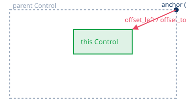

# Control Foundations

*Why your UI won't stay where you put it — the mental model, not the widget list.*

For "what node do I use for X," see [Control Nodes Reference](../control-nodes-reference/control-nodes-reference.md).
For assembled examples, see [HUD Recipes](../hud-recipes/hud-recipes.md).

---

## Control is screen-space, not world-space

`Control` (and everything that inherits it — Label, Button, containers, ProgressBar...)
lays out in 2D screen coordinates, independent of your game's camera. That's exactly
why HUDs use it: a health bar shouldn't shrink because the camera zoomed out.

**But only if it's not parented under something that *does* move with the camera.**
A Control dropped into your player scene, or anywhere under a `Camera2D`/world node,
inherits that transform and will drift, scale, or rotate with the world.

**Fix:** put HUD Controls under a `CanvasLayer`. A `CanvasLayer` renders above (or
below, via its `layer` property) everything in world space, ignoring the main
viewport's camera transform entirely.

```
CanvasLayer  (layer = 1)
└── Control / Container tree  ← your actual HUD
```

---

## Anchors + Offset = position

Every Control's rectangle is defined by two things, not one:

- **Anchor** — a point on the *parent's* rectangle, as a fraction from 0 to 1 on
  each axis. `(0, 0)` is the parent's top-left, `(1, 1)` is bottom-right, `(0.5, 0.5)`
  is center.
- **Offset** (called *Margin* in Godot 3) — a pixel distance from that anchor point
  to the Control's actual edge.



This is why a Control that looks fine at one window size drifts at another: anchor
`(0, 0)` with offsets pins you to a fixed pixel distance from the top-left corner —
resize the window and everything else moves, but that pixel offset doesn't. Anchor
`(1, 1)` pins to bottom-right instead, which is usually what you want for something
like a minimap.

**Anchor presets** in the inspector (top-left icon in the Control toolbar) are just
shortcuts that set both anchors and offsets to common combinations — "full rect,"
"center," "bottom-right," etc. Use them instead of hand-typing fractions.

---

## Containers take over positioning entirely

Drop a Control inside a `VBoxContainer`, `HBoxContainer`, `GridContainer`,
`MarginContainer`, `CenterContainer`, or `PanelContainer`, and its anchors/offsets
stop mattering — **the container positions and sizes its children itself**, every
frame if needed (e.g. when a sibling's text changes length).

This is the #2 source of confusion after anchors: you drag a Label to where you want
it, save the scene, and next run it's snapped somewhere else — because it's inside a
container that just laid it out according to container rules, not where you dropped it.

Control your Control's behavior *inside* a container with:

- **Size flags** (`size_flags_horizontal` / `size_flags_vertical`) — do you want this
  child to fill the space the container gives it (`SIZE_FILL`), grow to consume any
  *extra* leftover space (`SIZE_EXPAND_FILL`), or shrink to its minimum and sit at
  one end (`SIZE_SHRINK_BEGIN` / `_CENTER` / `_END`)?
- **`custom_minimum_size`** — the smallest the container is allowed to shrink this
  child to. Containers respect this; they won't crush a button below its label size
  unless you let them.

**Rule of thumb:** if you're inside a container, stop thinking in anchors/offsets and
start thinking in size flags + minimum size. If you're *not* inside a container
(direct child of a `CanvasLayer` or plain `Control`), it's the reverse.

---

## Quick-Reference Table

| Concept | What it controls | Lives on |
|---|---|---|
| Anchor | fractional point on parent's rect | every Control |
| Offset / Margin | pixel distance from anchor to this Control's edge | every Control (ignored inside a container) |
| Size flags | how this Control shares/claims space from a container | every Control (ignored outside a container) |
| `custom_minimum_size` | floor on how small this Control can be shrunk | every Control |
| `CanvasLayer` | renders its subtree above/below world space, ignoring camera | put your whole HUD under one |

---

*[← back to index](../../README.md)*
