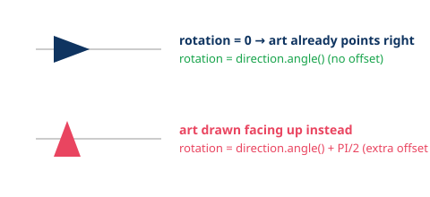

# Sprite Facing & Rotation Convention

*The gotcha: nothing in the engine forces your art to face any particular way — you have to draw it right, once, so the math doesn't need offsets forever.*

---

## 1. Angle 0 Points Right

In Godot (and math generally), `rotation = 0` and `Vector2.RIGHT` both mean "facing along +X" (right on screen). `rotation` increases **clockwise** in Godot's Y-down screen space.

## 2. Draw Your Art Facing Right

Don't rotate sprites in an image editor to "fix" their default facing — draw/export them facing right (0°) so `rotation` and `look_at()` line up with zero extra math. If your source art faces up or some other way, fix it once by rotating the frame in the editor or an import setting, not per-project offset math.



If you're stuck with art that faces up (common for top-down "ship" sprites), you can still make it work — just add `+ PI / 2` (or `- PI / 2`, check the direction) every time you compute rotation from a direction. It's not wrong, just an extra term you have to remember at every call site. Facing-right art avoids that entirely.

## 3. `flip_h` vs. Rotating

For **left/right-only** facing (platformers, top-down without full aiming), don't rotate — flip:

```gdscript
sprite.flip_h = velocity.x < 0
```

Cheaper, and avoids the soft/blurry look rotated pixel art gets at non-90° angles. Save `rotation` for sprites that need to point in arbitrary directions (top-down movement, turrets, projectiles).

## 4. Pointing a Sprite at a Direction

```gdscript
rotation = direction.angle()          # direction is a Vector2, normalized or not
look_at(target_global_position)       # rotates this node to face a global point
```

Both assume the art faces right at `rotation = 0`. `look_at()` is convenient but rotates the whole node — if you need the body to keep moving one way while only a sub-node (e.g. a turret) aims elsewhere, put the aiming part on a **child node** and rotate that instead of the parent.

## 5. Related Angle Ops

- `direction.angle()` — angle of a vector, in radians, matching the `rotation` convention above.
- `Vector2.RIGHT.rotated(angle)` — build a direction vector from an angle.
- See [Vector Math for Hand-Rolled 2D Physics](../vector-math-2d-physics/vector-math-2d-physics.md) for the underlying vector toolkit (`.angle()`, `.rotated()`, `.normalized()`, etc.) this convention builds on.

---

## Quick-Reference Table

| Situation | Use |
|---|---|
| Only ever faces left/right | `flip_h`, art drawn facing right |
| Faces any direction (top-down, turret) | `rotation = direction.angle()`, art drawn facing right |
| Rotate toward a point | `look_at(point)` |
| Body and aim need to differ | separate child node for the aiming part |
| Art drawn facing up/other | add a fixed `PI/2`-style offset at every rotation call site (or just redraw the art) |

---

*[← back to index](../../README.md)*
