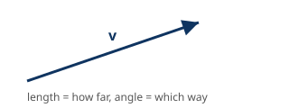
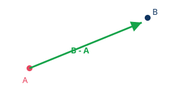
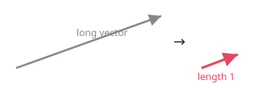
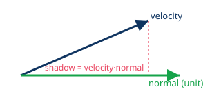
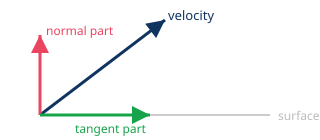

# Vector Math for Hand-Rolled 2D Physics

*Five ideas. That's the whole toolkit. — a reference sheet, not a textbook.*

---

## 1. A Vector Is an Arrow

`Vector2(x, y)` just means "go x right, y down." It has a **length** (how far) and a **direction** (which way). That's it — not a point, an arrow.



---

## 2. Subtraction = "To minus From"

This is the #1 source of confusion. Remember it as a phrase, not algebra:

> **B - A = the arrow that goes FROM A TO B**



In collision/contact code, `(global_position - other.global_position)` reads as **"me minus other"** → the arrow pointing FROM the other object TO me.

---

## 3. Normalize = "Direction Only"

`.normalized()` shrinks or stretches a vector to length 1, keeping the same direction. Use it whenever you want a **direction** but don't care about distance/speed.



**Always check for zero-length before normalizing** — normalizing `Vector2.ZERO` is meaningless (no direction to give). Guard it:

```gdscript
if some_vector == Vector2.ZERO:
    return
```

---

## 4. Dot Product = "How Aligned?"

`a.dot(b)` is one number that tells you how much two vectors point the same way:

- **positive** → same general direction
- **zero** → perpendicular (90°)
- **negative** → opposite directions



**Key trick:** if `normal` is a unit vector (length 1), then `velocity.dot(normal)` gives the exact **signed speed** along that direction — like a shadow cast onto the normal line. Negative means moving toward it, positive means moving away.

---

## 5. Splitting a Vector: Normal + Tangent

Any vector can be broken into "the part along a direction" and "everything else, perpendicular to it." This is how collision code separates *bounce* from *slide*.



```gdscript
var normal_speed := velocity.dot(normal)          # the red part, as a number
var tangent := velocity - normal * normal_speed   # subtract it out; what's left is green
# ...bounce normal_speed, apply friction to tangent, separately...
velocity = normal * normal_speed + tangent        # recombine
```

---

## Bonus: `move_toward` vs. `lerp`

| | `move_toward(target, step)` | `lerp(target, weight)` |
|---|---|---|
| Step size | fixed amount | % of remaining distance |
| Feels like | constant force/friction | spring / smoothing |
| Reaches target? | yes, exactly, then stops | never quite (asymptotic) |
| Use for | friction, constant thrust | camera follow, smoothing |

---

## Quick-Reference Table

| Method | Gives you |
|---|---|
| `a - b` | arrow FROM b TO a |
| `a.length()` | distance / speed (scalar) |
| `a.normalized()` | same direction, length 1 |
| `a.dot(b)` | alignment; speed along b if b is unit |
| `a.distance_to(b)` | same as `(b - a).length()` |
| `a.move_toward(b, s)` | step s units toward b, fixed rate |
| `a.rotated(rad)` | a spun by an angle |

---

*[← back to index](../../README.md)*
